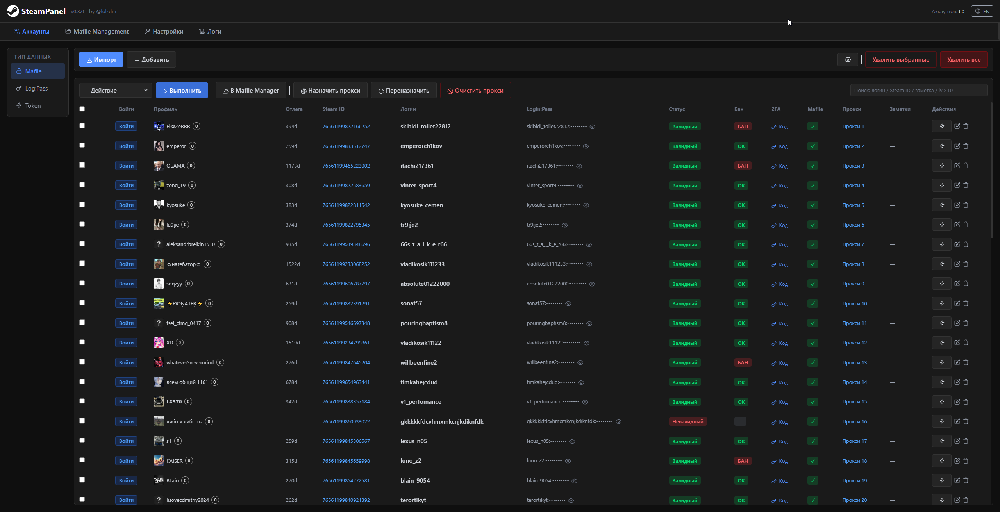

# SteamPanel

> [English version](assets/README_EN.md) | **Автор:** [@lolzdm](https://t.me/lolzdm)

Self-hosted веб-панель для массового управления Steam-аккаунтами. Backend на FastAPI + SQLite, фронт на React. Все операции выполняются пачками, прокси поддерживаются, прогресс задач в реальном времени через SSE.

Поддерживает **3 типа аккаунтов**:
- **Mafile** — полные аккаунты с секретами (shared_secret, identity_secret)
- **Log:Pass** — логин + пароль
- **Token** — access/refresh токены *(в разработке, не работает)*

---

## Функционал

**Аккаунты**
- Импорт из `.txt`: `login:pass`, `login:pass:email:email_pass`, с mafile — любой формат
- Bulk-операции на выбранных или всех аккаунтах
- Поиск по логину, Steam ID, заметкам, уровню (`lvl>10`)
- Настраиваемые колонки для каждой вкладки

**Действия со Steam**
- Смена пароля (ручной / рандомный)
- Смена email
- Смена / удаление телефона
- Удаление Steam Guard
- Авто-подтверждение входов (accept logins)
- Открытие Steam в браузере через [NoDriver](https://github.com/ultrafunkamsterdam/nodriver) (Chrome автоматизация)

**Валидация**
- Проверка логина, банов, парсинг профиля (никнейм, аватар, уровень, последний онлайн)
- Настройка кол-ва потоков

**Прокси**
- HTTP / SOCKS5
- Форматы: `login:pass@ip:port`, `ip:port:login:pass` и др. + кастомный конструктор
- Проверка (alive/dead), round-robin назначение, очистка

**Mafile**
- Mafile'ы привязываются к аккаунтам через раздел **Аккаунты**
- Экспорт в ZIP: выбор конкретных полей mafile и Session-блока
- Форматы экспорта: **flat** (все файлы в корне), **per-folder** (папка на аккаунт), **single JSON** (один файл)
- Шаблоны имён файлов с переменными `{username}`, `{steamid}`
- Генерация `.txt`: глобальный `accounts.txt`, отдельный `.txt` в каждой папке, кастомный формат строки
  - Доступные переменные: `{login}`, `{password}`, `{email}`, `{email_password}`, `{steam_id}`, `{proxy}`, `{mafile}`
- Опция «не создавать папку для каждого аккаунта» при включённом глобальном `.txt`

**Инструменты**
- Генератор 2FA кодов по `shared_secret` — результат копируется по клику
- Настройки валидации: включение/отключение парсинга профиля (никнейм/аватар), проверки банов, количество потоков (1–50)
- Режим скрытия паролей (spoiler-режим)

---

## Установка

### Способ 1 — `run.bat` (Windows, рекомендуется)

Необходимо скачать архив, распаковать его и запустить `run.bat`.

Скрипт выполнит следующие действия автоматически:
1. Проверит наличие Python в системе
2. Создаст виртуальное окружение `venv`
3. Установит все необходимые зависимости
4. Запустит main.py

**Требования:** Python 3.14 — [python.org](https://python.org)

---

### Способ 2 — вручную

```bash
git clone https://github.com/LOLZ-dev/SteamPanel.git

cd SteamPanel

python -m venv venv 

venv\scripts\activate

pip install -r requirements.txt

python main.py
```

После запуска панель будет доступна по адресу `http://127.0.0.1:8000`.

> Chrome/Chromium требуется только для функции «Открыть в браузере».

---

## Лицензия

MIT — **by [@lolzdm](https://t.me/lolzdm)**
