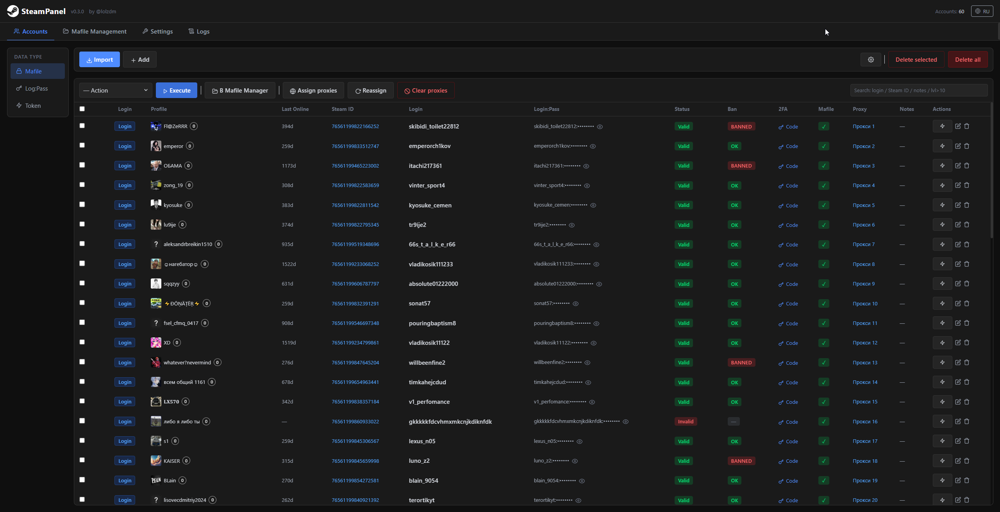

# SteamPanel

> [Русская версия](../README.md) | **Author:** [@lolzdm](https://t.me/lolzdm)

Self-hosted web panel for bulk Steam account management. FastAPI + SQLite backend, React frontend. Operations run in parallel, proxy support included, real-time task progress via SSE.

Supports **3 account types**:
- **Mafile** — full accounts with secrets (shared_secret, identity_secret)
- **Log:Pass** — login + password
- **Token** — access/refresh tokens *(work in progress, not functional)*

---

## Features

**Accounts**
- Import from `.txt`: `login:pass`, `login:pass:email:email_pass`, with mafile — any format
- Bulk operations on selected or all accounts
- Search by login, Steam ID, notes, level (`lvl>10`)
- Configurable columns per tab

**Steam Actions**
- Change password (manual / random)
- Change email
- Change / remove phone
- Remove Steam Guard
- Auto-accept logins
- Open Steam in browser via [NoDriver](https://github.com/ultrafunkamsterdam/nodriver) (Chrome automation)

**Validation**
- Login check, ban check, profile parsing (nickname, avatar, level, last online)
- Configurable thread count

**Proxies**
- HTTP / SOCKS5
- Formats: `login:pass@ip:port`, `ip:port:login:pass`, etc. + custom format builder
- Check (alive/dead), round-robin assignment, clear

**Mafile**
- Mafiles are linked to accounts via the **Accounts** section (import or manual assignment)
- Export to ZIP: select specific mafile and Session block fields
- Export formats: **flat** (all files at root), **per-folder** (one folder per account), **single JSON** (one merged file)
- File name templates with `{username}`, `{steamid}` variables
- `.txt` generation: global `accounts.txt`, per-folder `.txt`, custom line format
  - Available variables: `{login}`, `{password}`, `{email}`, `{email_password}`, `{steam_id}`, `{proxy}`, `{mafile}`
- “Don’t create folder per account” option when global `.txt` is enabled

**Tools**
- 2FA code generator by `shared_secret` — click result to copy
- Validation settings: toggle profile parsing (nickname / avatar), ban check, thread count (1–50)
- Password hiding (spoiler mode)

---

## Installation

### Option 1 — `run.bat` (Windows, recommended)

Download the archive, unpack, run `run.bat`.

The script will:
1. Check for Python
2. Create a `venv` virtual environment
3. Install dependencies
4. Start main.py

**Requirement:** Python 3.14 — [python.org](https://python.org)

---

### Option 2 — manual

```bash
git clone https://github.com/LOLZ-dev/SteamPanel.git

cd SteamPanel

python -m venv venv 

venv\scripts\activate

pip install -r requirements.txt

python main.py
```

Panel opens at `http://127.0.0.1:8000`.

> Chrome/Chromium is only needed for the "Open in browser" feature.

---

## License

MIT — **by [@lolzdm](https://t.me/lolzdm)**
